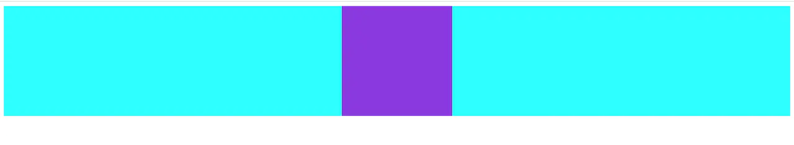
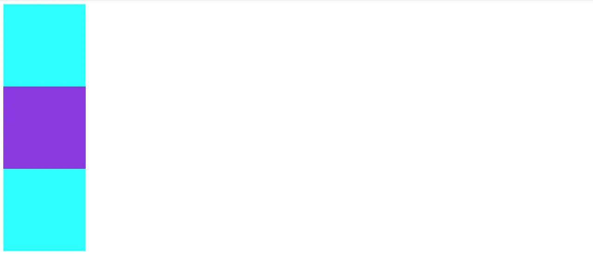
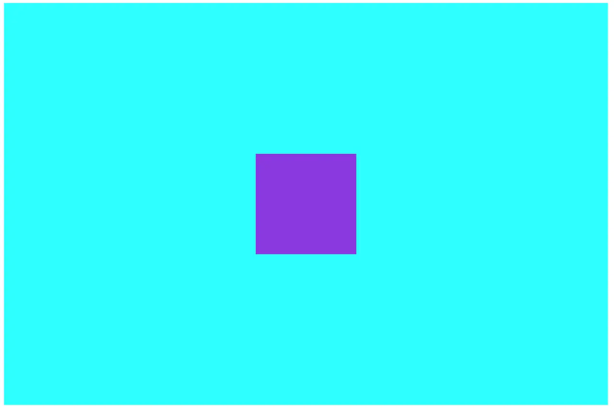
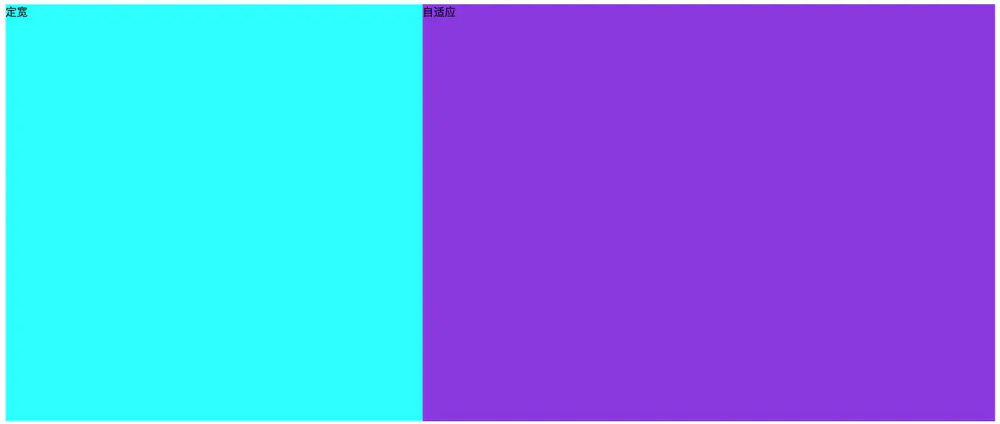
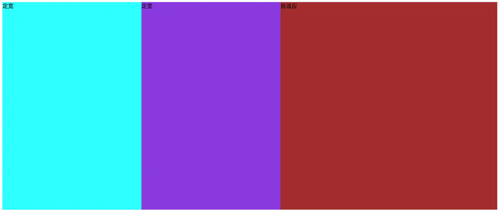
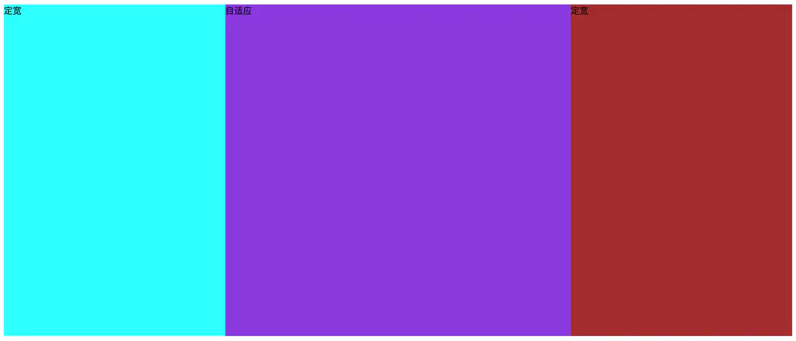
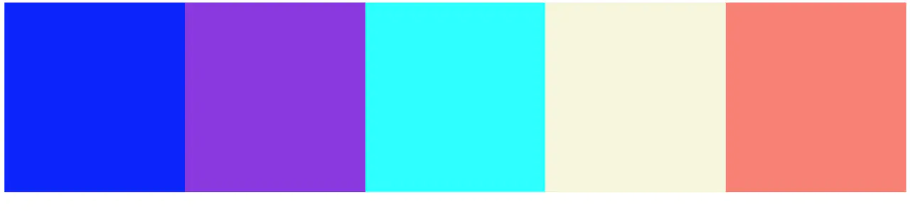
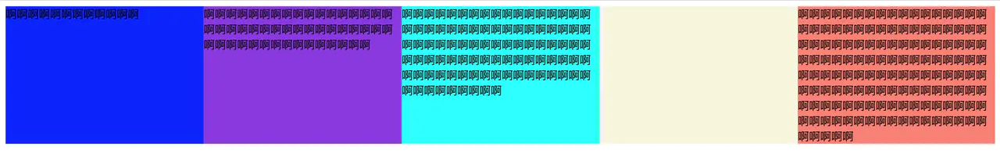
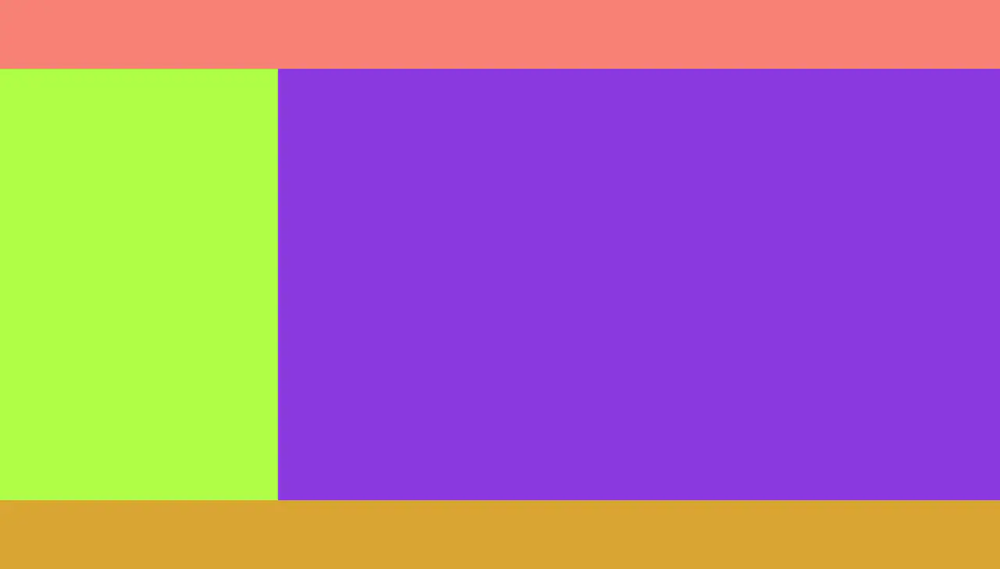

# css布局

## 1. 居中相关的布局

### 1.1 水平居中布局

效果图如下：


#### 方案一. inline-block + text-align

- 分析：display设置为inline-block的元素，具有文本元素的性质，其父元素可以通过设置文本对齐属性text-align来控制其在行内的对齐方式，text-align: center即为水平对齐

:::
注意：text-align属性是具有继承性的，会导致自己元素内部的文本也是居中显示的，需要自身设置text-align覆盖
:::

```html
<style>
    .wrap {
        width: 100%;
        height: 200px;
        background-color: aqua;
        text-align: center;
    }
    .content {
        width: 200px;
        height: 200px;
        background-color: blueviolet;
        display: inline-block;
    }
</style>
<body>
    <div class="wrap">
        <div class="content"></div>
    </div>
</body>
```

#### 方案二. 定位 + transform

- 分析：父元素开启定位（relative，absolute,fixed都可以）后，子元素设置绝对定位absolute后，left设置为50%，再使用transform: translateX(-50%)将子元素往反方向移动自身宽度的50%，便完成水平居中。

** 注意：父级元素是否脱离文档流，不影响子元素水平居中效果，但是transform是css3属性，存在浏览器兼容问题  **
```html
<style>
    .wrap {
        position: relative;
        width: 100%;
        height: 200px;
        background-color: aqua;
    }
    .content {
        position: absolute;
        left: 50%;
        transform: translateX(-50%);
        width: 200px;
        height: 200px;
        background-color: blueviolet;
    }
</style>
<body>
    <div class="wrap">
        <div class="content"></div>
    </div>
</body>
```

#### 方案三. display: block + margin: 0 auto

- 分析： 这个方法只需要对子元素进行设置就可以实现水平居中，margin设置auto表示浏览器会自动分配，实现来外边距等分效果。

** 注意： 这里子元素设置display为block或者table都是可以的，如果子元素脱离文档流（浮动，定位），会导致margin属性的值无效。 **

```html
<style>
    .wrap {
        width: 100%;
        height: 200px;
        background-color: aqua;
    }
    .content {
        width: 200px;
        height: 200px;
        background-color: blueviolet;
        display: table;
        margin: 0 auto;
    }
</style>
<body>
    <div class="wrap">
        <div class="content"></div>
    </div>
</body>
```

### 1.2 垂直居中布局

效果图如下：


#### 方案一. 定位 + transform

```html
<style>
    .wrap {
        position: relative;
        width: 200px;
        height: 600px;
        background-color: aqua;
    }
    .content {
        position: absolute;
        top: 50%;
        transform: translateY(-50%);
        width: 200px;
        height: 200px;
        background-color: blueviolet;
    }
</style>
<body>
    <div class="wrap">
        <div class="content"></div>
    </div>
</body>
```

#### 方案二. display: table-cell + vertical-align

- 分析：设置display: table-cell的元素具有td元素的行为，它的子元素布局方式类似文本元素，可以在父元素使用vertical-align: middle;实现子元素的垂直居中。

** 注意：vertical-align属性具有继承性，导致父元素内文本也是垂直居中显示的。**

```html
<style>
    .wrap {
        display: table-cell;
        vertical-align: middle;
        width: 200px;
        height: 600px;
        background-color: aqua;
    }
    .content {
        width: 200px;
        height: 200px;
        background-color: blueviolet;
    }
</style>
<body>
    <div class="wrap">
        <div class="content"></div>
    </div>
</body>
```

### 1.3 水平垂直居中布局

效果图如下：


#### 方案一.定位 + transform

```html
<style>
    .wrap {
        position: relative;
        width: 1200px;
        height: 800px;
        background-color: aqua;
    }
    .content {
        position: absolute;
        left: 50%;
        top: 50%;
        transform: translate(-50%, -50%);
        width: 200px;
        height: 200px;
        background-color: blueviolet;
    }
</style>
<body>
    <div class="wrap">
        <div class="content"></div>
    </div>
</body>
```

#### 方案二. 结合水平布局方案三，垂直布局方案二

```html
<style>
    .wrap {
        display: table-cell;
        vertical-align: middle;
        width: 1200px;
        height: 800px;
        background-color: aqua;
    }
    .content {
        margin: 0 auto;
        width: 200px;
        height: 200px;
        background-color: blueviolet;
    }
</style>
<body>
    <div class="wrap">
        <div class="content"></div>
    </div>
</body>
```

### 1.4 使用flex进行居中布局

- 分析：使用flex，水平垂直居中会变得非常容易，默认情况下，align-items: center垂直居中（交叉轴排列方式），justify-content: center水平居中（主轴排列方式） 注意： 需要考虑浏览器兼容性问题。

```html
 <style>
     .wrap {
         display: flex;
         align-items: center;
         justify-content: center;
         width: 1200px;
         height: 800px;
         background-color: aqua;
     }
     .content {
         width: 200px;
         height: 200px;
         background-color: blueviolet;
     }
 </style>
 <body>
     <div class="wrap">
         <div class="content"></div>
     </div>
 </body>
```


## 2. N列布局

### 2.1 两列布局（定宽+自适应）

效果图如下：


#### 1. 使用float+margin

- 原理：通过将左框脱离文本流，加上右框向右移动一定的距离，以达到视觉上的多列布局。

- 用法：先将左框设置为float:left、margin-left:px，再设置右框margin-left:px。
** 注意：我们左边元素使用了浮动，但是右边元素没有浮动**

```html
<div class="parent">
    <div class="left">
        <p>left定宽</p>
    </div>
    <div class="right">
        <p>right自适应</p>
        <p>right自适应</p>
    </div>
</div>
```

```css
.left {
    float:left;
    width:100px;
}
.right {
    margin-left:120px;
}
```

#### 2. 使用float+margin（改良版）

- 原理：在1）的基础之上，通过向右框添加一个父框，再加上设置左、右父框属性使之产生BFC以去除bug。

- 用法：先将左框设置为float:left、margin-left:px、position:relative，再设置右父框float:right、width:100%、margin-left:px，最后设置实际的右框margin-left:*px。

```css
.left {
    float:left;
    width:100px;
    position:relative;
}
.right-fix {
    float:right;
    width:100%;
    margin-left:-100px;
}
.right {
    margin-left:120px;
}
```

#### 3. 使用float+overflow

- 原理：通过将左边框脱离文本流，设置右边规定当内容溢出元素框时发生的事情以达到多列布局。右边元素由于设置overflow:hidden开启BFC，与外界隔离，所以能实现效果

- 用法：先将左框设置为float:left、width:px、margin-left:p，再设置实际的右框overflow:hidden。

** 注意：overflow:hidden的设置也使得右边元素内容超出隐藏。这里如果不设置overflow:hidden，右边元素的宽度是100%，有一部分被左边浮动元素盖住，不是我们要的结果，虽然看起来没什么区别。**

```css
.left {
    float:left;
    width:100px;
    margin-right:20px;
}
.right {
    overflow:hidden;
}
```

#### 4. 使用table

- 原理：通过将父框设置为表格，将左右边框转化为类似于同一行的td，从而达到多列布局。这里主要是基于表格元素，在没有设置宽度时，会自动分配宽度来实现布局的。

- 用法：先将父框设置为display:table、width:100%、table-layout:fixed，再设置左右框display:table-cell，最后设置左框width:px、padding-right:px。

** 注意：设置为表格后，在某些浏览器可能会受到表格本身特有行为的影响，比如表格边框等等。**

```css
.parent {
    display:table;
    width:100%;
    table-layout:fixed;
}
.left {
    width:100px;
    padding-right:20px;
}
.right,.left {
    display:table-cell;    
}
```


#### 5. 使用flex

- 原理：通过设置CSS3布局利器flex中的flex属性以达到多列布局。父容器采用flex布局，左边元素定宽之后，右边元素，因为只有一个，所以flex属性设置为不是0的正值（也就是设置flex-grow），都会占满剩余空间。

- 用法：先将父框设置为display:flex，再设置左框flex:1，最后设置左框width:px、margin-right:px。

```css
.parent {
    display:flex;
}
.left {
    width:100px;
    margin-right:20px;
}
.right {
    flex:1;
}
```

### 2.2 三列布局

### 2.2.1 两列定宽+一列自适应

效果图如下：


#### 1. 使用float + overflow:hidden

- 原理：这种情况与两列定宽查不多。

- 用法：先将左、中框设置为float:left、width:px、margin-right:px，再设置右框overflow:hidden。

```html
<style>
    .l, .c, .r {
        height: 600px;
    }
    .l {
        width: 400px;
        background-color: aqua;
        float: left;
    }
    .c {
        width: 400px;
        background-color: blueviolet;
        float: left;
    }
    .r {
        background-color: brown;
        overflow: hidden;
    }
</style>
<body>
    <div class="l">定宽</div>
    <div class="c">定宽</div>
    <div class="r">自适应</div>
</body>
```

#### 2. flex布局

```html
 <style>
     .w {
         display: flex;
         height: 600px;
     }
     .l {
         width: 400px;
         background-color: aqua;
     }
     .c {
         width: 400px;
         background-color: blueviolet;
     }
     .r {
         flex: 1;
         background-color: brown;
     }
 </style>
 <body>
     <div class="w">
         <div class="l">定宽</div>
         <div class="c">定宽</div>
         <div class="r">自适应</div>
     </div>
 </body>
```

### 2.2.2 圣杯布局

- 两侧宽度固定，中间宽度自适应的三列布局（中间元素不需要嵌套子元素）

效果图如下：


#### 方案一. 左右两侧浮动，中间元素使用margin

- 这种方法就是左右两边浮动，给定宽度，中间元素使用margin空出左右两边元素的位置，实现比较简单。

** 注意：这种方式，需要在书写html结构时，将右侧元素写在中间元素的前面，因为如果右侧元素在中间元素后面，由于浮动元素位置上不能高于（或平级）前面的非浮动元素，导致右侧元素会下沉。但是，中间元素一般都是页面的核心部分，放在比较后面的位置，不利于SEO。**

```html
<style>
    .l, .c, .r {
        height: 600px;
    }
    .l {
        width: 400px;
        background-color: aqua;
        float: left;
    }
    .c {
        background-color: blueviolet;
        margin-left: 400px;
        margin-right: 400px;
    }
    .r {
        width: 400px;
        background-color: brown;
        float: right;
    }
</style>
<body>
    <div class="l">定宽</div>
    <div class="r">定宽</div>
    <div class="c">自适应</div>
</body>
```

#### 方案二. 父容器使用margin，左中右元素均浮动，利用定位和margin移动到正确位置

- 这种方法将中间元素c放置在最前面，有利于SEO。

```html
<style>
    .w {
        /* margin-left对应左边元素l的宽度，margin-right对应右边元素r的宽度 */
        margin-left: 400px;
        margin-right: 400px;
    }
    .l, .c, .r {
        height: 600px;
        float: left;
    }
    .l {
        width: 400px;
        background-color: aqua;
        position: relative;
        /* 为了让l元素从当前行移动到第一行同一位置*/
        margin-left: -100%;
        /* 移动到中间元素左侧正确位置 */
        left: -400px; 
    }
    .c {
        width: 100%;
        background-color: blueviolet;
    }
    .r {
        width: 400px;
        background-color: brown;
        position: relative;
        /* 为了让l元素从当前行移动到上一行*/
        margin-left: -400px;
        right: -400px;
    }
</style>
<body>
    <div class="w">
        <div class="c">自适应</div>
        <div class="l">定宽</div>
        <div class="r">定宽</div>
    </div>
</body>
```

### 2.2.3. 双飞翼布局
- 两侧宽度固定，中间宽度自适应的三列布局（中间元素内部增加子元素用于放置内容）
效果图如下：


#### 方案一. 中间元素子元素设置margin，左中右元素均设置浮动，左右元素通过margin移动到正确位置

- 分析：这种方法为中间元素增加子元素作为内容区域，通过子元素设置margin完成。

```html
<style>
    .l, .c, .r {
        height: 600px;
        float: left;
    }
    .l {
        width: 400px;
        background-color: aqua;
        /* 为了让l元素从当前行移动到第一行同一位置*/
        margin-left: -100%;
    }
    .c {
        width: 100%;
        background-color: blue;
    }
    .i {
        height: 600px;
        background-color: blueviolet;
        margin-left: 400px;
        margin-right: 400px;
    }
    .r {
        width: 400px;
        background-color: brown;
         /* 为了让r元素移动到第一行*/
        margin-left: -400px;
    }
</style>
<body>
    <div class="c">
        <div class="i">自适应</div>
    </div>
    <div class="l">定宽</div>
    <div class="r">定宽</div>
</body>
```


### 2.2.4. flex布局实现（中间自适应，左右等宽）

```html
<style>
    .w {
        display: flex;
        height: 600px;
    }
    .l {
        width: 400px;
        background-color: aqua;
    }
    .c {
        flex: 1;
        background-color: blueviolet;
    }
    .r {
        width: 400px;
        background-color: brown;
    }
</style>
<body>
    <div class="w">
        <div class="l">定宽</div>
        <div class="c">自适应</div>
        <div class="r">定宽</div>
    </div>
</body>
```

### 2.3 多列等分布局

效果图如下：


- 公式转化:c = w n + g (n-1) -> c = w n + g n - g -> c + g = （w + g） * n

- 我们需要解决两个问题：
    1. 如何让总宽度增加g(即：c+g)
    2. 如何让每个宽包含g（即：w+g）

#### 方案一. 浮动 + 百分数平分

- 这种方案就是每一列浮动，之后按照百分比平分宽度，实现简单。

```html
<style>
    .w{
        margin-left: -20px;//c增加g
    }
   .col {
        float: left;
        width: 20%;
        height: 300px;
        padding-left: 20px;
        box-sizing: border-box;//包含padding区域 w+g
   }
   .col1 {
       background-color: blue;
   }
   .col2 {
       background-color: blueviolet;
   }
   .col3 {
       background-color: aqua;
   }
   .col4 {
       background-color: beige;
   }
   .col5 {
       background-color: salmon;
   }
</style>
<body>
    <div class="w">
        <div class="col col1"></div>
        <div class="col col2"></div>
        <div class="col col3"></div>
        <div class="col col4"></div>
        <div class="col col5"></div>
    </div>
</body>
```

#### 方案二. 使用display: table布局

- 分析：父容器指定display: table，设置布局行为table-layout: fixed，指定每个表格等宽。

** 注意： table-layout: fixed是需要设置的，默认情况下，列宽度由单元格内容设定，设置之后，列宽由表格宽度和列宽度设定。**

```html
<div class="parent-fix">
    <div class="parent">
        <div class="column"><p>1</p></div>
        <div class="column"><p>2</p></div>
        <div class="column"><p>3</p></div>
        <div class="column"><p>4</p></div>
    </div>
</div>
```

```css
.parent-fix{
    margin-left: -20px;//c+g
}
.parent{
    display: table;
    width:100%;
    table-layout: fixed;
}
.column{
    display: table-cell;
    padding-left: 20px;//w+g
}
```

#### 方案三. 使用column布局
- 分析：使用column布局，指定内容区域需要分为5列即可。

```html
 <style>
     .w {
         /* 指定列数 */
         column-count: 5;
         /* 指定列与列之间的间隙，默认1em */
         column-gap: 0;
     }
     .col {
         height: 300px;
     }
     .col1 {
         background-color: blue;
     }
     .col2 {
         background-color: blueviolet;
     }
     .col3 {
         background-color: aqua;
     }
     .col4 {
         background-color: beige;
     }
     .col5 {
         background-color: salmon;
     }
 </style>
 <body>
     <div class="w">
         <div class="col col1"></div>
         <div class="col col2"></div>
         <div class="col col3"></div>
         <div class="col col4"></div>
         <div class="col col5"></div>
     </div>
 </body>
```

#### 方案四. 使用flex布局

- 分析：使用flex布局十分简单，指定每一列所占空间相同即可

```html
<div class="parent">
    <div class="column"><p>1</p></div>
    <div class="column"><p>2</p></div>
    <div class="column"><p>3</p></div>
    <div class="column"><p>4</p></div>
</div>
```

```css
.parent{
    display: flex;
}
.column{
    flex: 1;
}
.column+.column{
    margin-left:20px;
}
```

### 2.4 多列等高布局

- 所谓多列等高布局，就是多类内容可能不一样，但是保证每一列的高度是相同的，这个高度应该由内容最多的那一列决定。

效果图如下：


#### 方案一. 使用display: table布局

- 分析：父元素设置display: table，子元素设置display: table-cell，这样布局就是按照表格行为布局，表格单元格默认等高。

```html
 <style>
    .w {
        display: table;
    }
    .col {
        display: table-cell;
        width: 20%;
    }
    .col1 {
        background-color: blue;
    }
    .col2 {
        background-color: blueviolet;
    }
    .col3 {
        background-color: aqua;
    }
    .col4 {
        background-color: beige;
    }
    .col5 {
        background-color: salmon;
    }
 </style>
 <body>
     <div class="w">
         <div class="col col1">啊啊啊啊啊啊啊啊啊啊啊啊</div>
         <div class="col col2">啊啊啊啊啊啊啊啊啊啊啊啊啊啊啊啊啊啊啊啊啊啊啊啊啊啊啊啊啊啊啊啊啊啊啊啊啊啊啊啊啊啊啊啊啊啊啊啊啊</div>
         <div class="col col3">啊啊啊啊啊啊啊啊啊啊啊啊啊啊啊啊啊啊啊啊啊啊啊啊啊啊啊啊啊啊啊啊啊啊啊啊啊啊啊啊啊啊啊啊啊啊啊啊啊啊啊啊啊啊啊啊啊啊啊啊啊啊啊啊啊啊啊啊啊啊啊啊啊啊啊啊啊啊啊啊啊啊啊啊啊啊啊啊啊啊啊啊啊啊</div>
         <div class="col col4"></div>
         <div class="col col5">啊啊啊啊啊啊啊啊啊啊啊啊啊啊啊啊啊啊啊啊啊啊啊啊啊啊啊啊啊啊啊啊啊啊啊啊啊啊啊啊啊啊啊啊啊啊啊啊啊啊啊啊啊啊啊啊啊啊啊啊啊啊啊啊啊啊啊啊啊啊啊啊啊啊啊啊啊啊啊啊啊啊啊啊啊啊啊啊啊啊啊啊啊啊啊啊啊啊啊啊啊啊啊啊啊啊啊啊啊啊啊啊啊啊啊啊啊啊啊啊啊啊啊啊啊啊啊啊啊啊啊啊啊啊啊啊啊啊啊啊啊</div>
     </div>
 </body>
```

#### 方案二. 使用flex布局

- 分析： 默认情况下，display: flex的元素align-items属性值为stretch，如果项目未设置高度或设为auto，将占满整个容器的高度。

```html
 <style>
    .w {
        display: flex;
    }
    .col {
        flex: 1;
    }
    .col1 {
        background-color: blue;
    }
    .col2 {
        background-color: blueviolet;
    }
    .col3 {
        background-color: aqua;
    }
    .col4 {
        background-color: beige;
    }
    .col5 {
        background-color: salmon;
    }
 </style>
 <body>
     <div class="w">
         <div class="col col1">啊啊啊啊啊啊啊啊啊啊啊啊</div>
         <div class="col col2">啊啊啊啊啊啊啊啊啊啊啊啊啊啊啊啊啊啊啊啊啊啊啊啊啊啊啊啊啊啊啊啊啊啊啊啊啊啊啊啊啊啊啊啊啊啊啊啊啊</div>
         <div class="col col3">啊啊啊啊啊啊啊啊啊啊啊啊啊啊啊啊啊啊啊啊啊啊啊啊啊啊啊啊啊啊啊啊啊啊啊啊啊啊啊啊啊啊啊啊啊啊啊啊啊啊啊啊啊啊啊啊啊啊啊啊啊啊啊啊啊啊啊啊啊啊啊啊啊啊啊啊啊啊啊啊啊啊啊啊啊啊啊啊啊啊啊啊啊啊</div>
         <div class="col col4"></div>
         <div class="col col5">啊啊啊啊啊啊啊啊啊啊啊啊啊啊啊啊啊啊啊啊啊啊啊啊啊啊啊啊啊啊啊啊啊啊啊啊啊啊啊啊啊啊啊啊啊啊啊啊啊啊啊啊啊啊啊啊啊啊啊啊啊啊啊啊啊啊啊啊啊啊啊啊啊啊啊啊啊啊啊啊啊啊啊啊啊啊啊啊啊啊啊啊啊啊啊啊啊啊啊啊啊啊啊啊啊啊啊啊啊啊啊啊啊啊啊啊啊啊啊啊啊啊啊啊啊啊啊啊啊啊啊啊啊啊啊啊啊啊啊啊啊</div>
     </div>
 </body>
```

## 3.全屏布局

- 所谓全屏布局，就是实现经典的头部，内容区，底部三大区域占满全屏的布局，这种布局很常见。

效果图如下：


```html
 <style>
        html, body {
            margin: 0;
            overflow: hidden;
        }
        .header {
            position: fixed;
            left: 0;
            top: 0;
            right: 0;
            height: 100px;
            background-color: salmon;
        }

        .w {
            position: fixed;
            left: 0;
            right: 0;
            top: 100px;
            bottom: 100px;
            overflow: auto;
            background-color: palevioletred;
        }

        .w .l {
            width: 400px;
            /* height: 100%; */
            position: fixed;
            left: 0;
            top: 100px;
            bottom: 100px;
            background-color: greenyellow;
        }

        .w .r {
            position: fixed;
            left: 400px;
            right: 0;
            top: 100px;
            bottom: 100px;
            background-color: blueviolet;
        }

        .footer {
            position: fixed;
            left: 0;
            right: 0;
            bottom: 0;
            height: 100px;
            background-color: goldenrod;
        }
    </style>
    <body>
        <div class="header"></div>
        <div class="w">
            <div class="l"></div>
            <div class="r"></div>
        </div>
        <div class="footer"></div>
    </body>
```

- 全屏布局的特点

    - 浏览器变大时，撑满窗口

    - 滚动条不是全局滚动条，而是出现在内容区域里，往往是主内容区域

### 1. 使用position

```html
<div class="parent">
    <div class="top">top</div>
    <div class="left">left</div>
    <div class="right">
        <div class="inner">right</div>
    </div>
    <div class="bottom">bottom</div>
</div>
```

```css
html,body,.parent{
    margin:0;
    height:100%;
    overflow:hidden;
}
body{
    color:white;
}
.top{
    position:absolute;
    top:0;
    left:0;
    right:0;
    height:100px;
    background:blue;
}
.left{
    position:absolute;
    left:0;
    top:100px;
    bottom:50px;
    width:200px;
    background:red;
}
.right{
    position:absolute;
    left:200px;
    top:100px;
    bottom:50px;
    right:0;
    background:pink;
    overflow: auto;
}
.right .inner{
    min-height: 1000px;
}
.bottom{
    position:absolute;
    left:0;
    right:0;
    bottom:0;
    height:50px;
    background: black;
}
```

### 2. 使用flex

```html
<div class="parent">
    <div class="top">top</div>
    <div class="middle">
        <div class="left">left</div>
        <div class="right">
            <div class="inner">right</div>
        </div>
    </div>
    <div class="bottom">bottom</div>
</div>
```

```css
html,body,.parent{
    margin:0;
    height:100%;
    overflow:hidden;
}
body{
    color: white;
} 
.parent{
    display: flex;
    flex-direction: column;
}
.top{
    height:100px;
    background: blue;
}
.bottom{
    height:50px;
    background: black;
}
.middle{
    flex:1;
    display:flex;
}
.left{
    width:200px;
    background: red;
}
.right{
    flex: 1;
    overflow: auto;
    background:pink;
}
.right .inner{
    min-height: 1000px;
}
```

### 全屏布局的小结

方案 | 兼容性 | 性能 | 自适应
--- | --- | --- | ---
Position | 好 | 好 | 部分自适应
Flex|	较差|	差|	可自适应
Grid|	差|	较好|	可自适应

## 不定宽+自适应

### 1. 使用float+overflow

- 原理：这种情况与两列定宽查不多。

- 用法：先将左框设置为float:left、margin-right:px，再设置右框overflow: hidden，最后设置左框中的内容width: px。

```
<div class="parent">
    <div class="left">
        <p>left</p>
    </div>
    <div class="right">
        <p>right</p>
        <p>right</p>
    </div>
</div>
```

```
.left{
        float: left;
        margin-right: 20px;
    }
.right{
    overflow: hidden;
}
.left p{
    width: 200px;
}
```

### 2. 使用table

- 原理：通过将父框改变为表格，将左右框转换为类似于同一行的td以达到多列布局，设置父框宽度100%，给左框子元素一个固定宽度从而达到自适应。

- 用法：先将父框设置为display: table、width: 100%，再设置左、右框display: table-cell，最后设置左框width: 0.1%、padding-right: px以及左框中的内容width: px。

```
.parent{
    display: table; width: 100%;
    }
.left,.right{
    display: table-cell;
}
.left{
    width: 0.1%;
    padding-right: 20px;
}
.left p{
    width:200px;
}
```

### 3. 使用flex

- 原理：通过设置CSS3布局利器flex中的flex属性以达到多列布局，加上给左框中的内容定宽、给右框设置flex达到不定款+自适应。

- 用法：先将父框设置为display:flex，再设置右框flex:1，最后设置左框margin-right:20px、左框中的内容width: *px。

```
.parent {
    display:flex;
}
.left {
    margin-right:20px;
}
.right {
    flex:1;
}
.left p{
    width: 200px;
}
```

## 两列不定宽+一列自适应

### 1. float + margin + overflow

- 原理：这个情况与一列不定宽+一列自适应查不多。

- 用法：先将左、中框设置为float:left、margin-right:px，再设置右框overflow:hidden，最后给左中框中的内容设置width: *px。

```
<div class="parent">
    <div class="left">
        <p>left</p>
    </div>
    <div class="center">
        <p>center</p>
    </div>
    <div class="right">
        <p>right</p>
        <p>right</p>
    </div>
</div>
```

```
.left,.center{
    float: left;
    margin-right: 20px;
}
.right{
    overflow: hidden;
}
.left p,.center p{
    width: 100px;
}
```


## 定宽+自适应+两块高度一样高

### 1. 使用table

```
<div class="parent">
    <div class="left">
        <p>left</p>
    </div>
    <div class="right">
        <p>right</p>
        <p>right</p>
    </div>
</div>
```

```
.parent {
    display:table;
    width:100%;
    table-layout:fixed;
}
.left {
    width:100px;
    padding-right:20px;
}
.right,.left {
    display:table-cell;
}
```

### 2. 使用flex

```
<div class="parent">
    <div class="left">
        <p>left</p>
    </div>
    <div class="right">
        <p>right</p>
        <p>right</p>
    </div>
</div>
```

```
.parent {
    display:flex;
}
.left {
    width:100px;
    margin-right:20px;
}
.right {
    flex:1;
}
```

### 3. 使用float

```
<div class="parent">
    <div class="left">
        <p>left</p>
    </div>
    <div class="right">
        <p>right</p>
        <p>right</p>
    </div>
</div>
```

```
p{
    background: none!important;
}
.left,.right{
    background: #444;
}
.parent{
    overflow: hidden;
}
.left,.right{
    padding-bottom: 9999px;
    margin-bottom: -9999px;
}
.left{
    float: left; width: 100px;
    margin-right: 20px;
}
.right{
    overflow: hidden;
}
```


## 全屏布局

### 全屏布局的特点

- 浏览器变大时，撑满窗口

- 滚动条不是全局滚动条，而是出现在内容区域里，往往是主内容区域


### 1. 使用position

```html
<div class="parent">
    <div class="top">top</div>
    <div class="left">left</div>
    <div class="right">
        <div class="inner">right</div>
    </div>
    <div class="bottom">bottom</div>
</div>
```

```css
html,body,.parent{
    margin:0;
    height:100%;
    overflow:hidden;
}
body{
    color:white;
}
.top{
    position:absolute;
    top:0;
    left:0;
    right:0;
    height:100px;
    background:blue;
}
.left{
    position:absolute;
    left:0;
    top:100px;
    bottom:50px;
    width:200px;
    background:red;
}
.right{
    position:absolute;
    left:200px;
    top:100px;
    bottom:50px;
    right:0;
    background:pink;
    overflow: auto;
}
.right .inner{
    min-height: 1000px;
}
.bottom{
    position:absolute;
    left:0;
    right:0;
    bottom:0;
    height:50px;
    background: black;
}
```

### 2. 使用flex

```html
<div class="parent">
    <div class="top">top</div>
    <div class="middle">
        <div class="left">left</div>
        <div class="right">
            <div class="inner">right</div>
        </div>
    </div>
    <div class="bottom">bottom</div>
</div>
```

```css
html,body,.parent{
    margin:0;
    height:100%;
    overflow:hidden;
}
body{
    color: white;
} 
.parent{
    display: flex;
    flex-direction: column;
}
.top{
    height:100px;
    background: blue;
}
.bottom{
    height:50px;
    background: black;
}
.middle{
    flex:1;
    display:flex;
}
.left{
    width:200px;
    background: red;
}
.right{
    flex: 1;
    overflow: auto;
    background:pink;
}
.right .inner{
    min-height: 1000px;
}
```


### 1. 使用flex

```html
<div class="parent">
    <div class="top">top</div>
    <div class="middle">
        <div class="left">left</div>
        <div class="right">
            <div class="inner">right</div>
        </div>
    </div>
    <div class="bottom">bottom</div>
</div>
```

```css
html,body,.parent{
    margin:0;
    height:100%;
    overflow:hidden;
}
body{
    color:white;
} 
.parent{
    display:flex;
    flex-direction:column;
}
.top{
    background:blue;
}
.bottom{
    background:black;
}
.middle{
    flex:1;
    display:flex;
}
.left{
    background: red;
}
.right{
    flex:1;
    overflow:auto;
    background: pink;
}
.right .inner{
    min-height:1000px;
}
```

### 全屏布局的小结

方案 | 兼容性 | 性能 | 自适应
--- | --- | --- | ---
Position | 好 | 好 | 部分自适应
Flex|	较差|	差|	可自适应
Grid|	差|	较好|	可自适应

## 多列布局

### 多列布局（multi-column）相关属性：
- 列数和列宽：column-count、column-width、columns
- 列的间距和分列样式：column-gap、column-rule-color、column-rule-style、column-rule-width、column-rule
- 跨越列：column-span
- 填充列：column-fill
- 分栏符：column-break-before、column-break-after、column-break-inside


### 1. 列数和列宽
- 列数（column-count）：用来指定一个多列元素的列数。语法：
```css
<!--auto是column-count的默认值，当设置为auto时，元素分栏由其他属性决定，比如后面要讲的column-width；
它还可以是任何正整数数字，不能带单位，用来表示多列布局的列数。-->

column-count: auto || number
<!--兼容写法-->
-moz-column-count: auto || number;
-webkit-column-count: auto || number;
column-count: auto || number;

```
- 列宽（column-width）：用来设置多列布局的列宽。
```css
column-width: auto || length;

<!--默认值为auto，如果设置为auto或没有显式的设置此值时，列宽由其他属性来决定，比如：由column-count来决定；
此值还可以用固定值来设置列宽，单位可以是px或em，但不能是负值。-->

```

- columns是复合属性:

### 2. 列的间距和分列样式
- 列的间距（column-gap）:用来设置列与列之间的距离.
```css
column-gap: normal || length;
<!--默认值为normal，W3C建议1em值。此值还可以是任何非负整数值，单位可以是px、em、vw等。-->
```
- 分列样式（column-rule）：用来设置列与列之间的边框宽度、样式和颜色。
```css
column-rule:  ||   ||  ;
<!--参数说明-->
<!--column-rule-width：用来设置column-rule的样式，默认值为“none”，类似于border-width属性。-->
<!--column-rule-style：用来设置column-rule的样式，默认为none，此属性的样式和border-style的样式一样：-->
column-rule-style: none|hidden|dotted|dashed|solid|double|groove|ridge|inset|outset;
<!--column-rule-color：用来设置column-rule的颜色，类似border-color属性，如果不想显示颜色，可设置为transparent（透明色）。-->
```

### 3. 跨越列（column-span）：指定某个元素跨越多少列。
```css
column-span: none || all;
<!--默认值为none，表示不跨越任何列；all表示元素跨越所有列。-->
```
```
.columns{   
    border:1px solid #000;   
    padding:10px;   
    width:350px;   
    columns:auto 3;   
}   
h2{   
    -webkit-column-span:all;   
    column-span:all;   
}
```


### 4. 填充列（column-fill）：用来设置元素所有列的高度是否统一。  
```css
column-fill: auto || balance;
<!--默认值为auto，表示列高度自适应内容；此值设为balance时，所有列的高度以其中最高的一列统一。-->
```
### 5. 分栏符（column-break-before、column-break-after、column-break-inside） 三个属性都是用来设置对象何时断行。   
```css
column-break-before：设置或检索对象之前是否断行。
column-break-after：设置或检索对象之后是否断行。
column-break-inside：设置或检索对象内部是否断行。
```