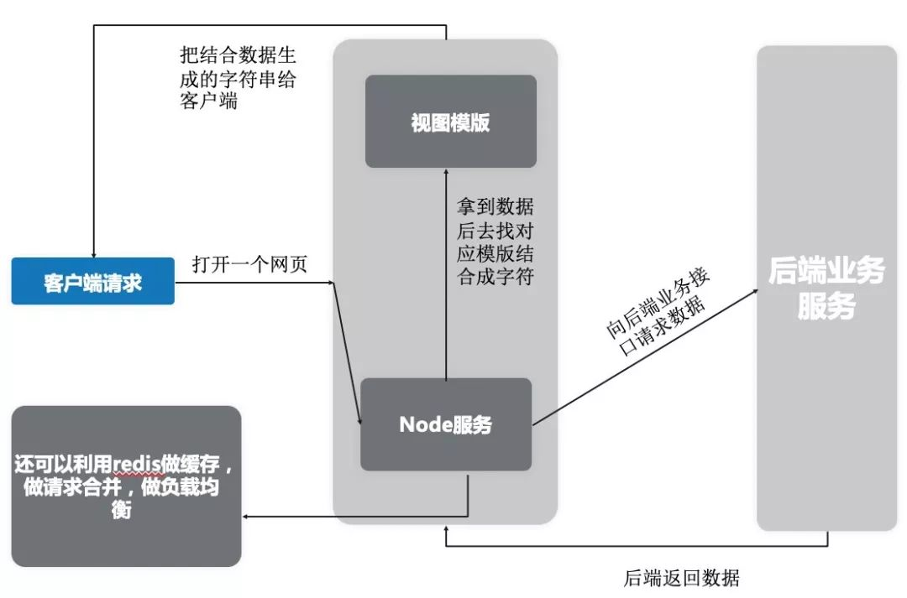
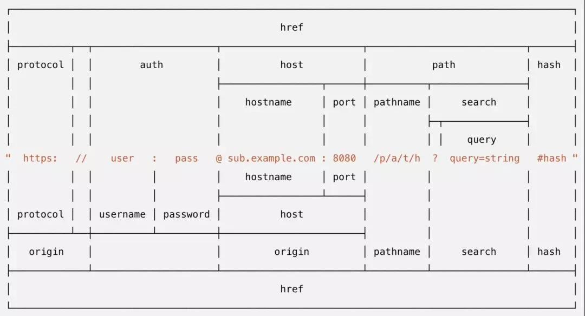
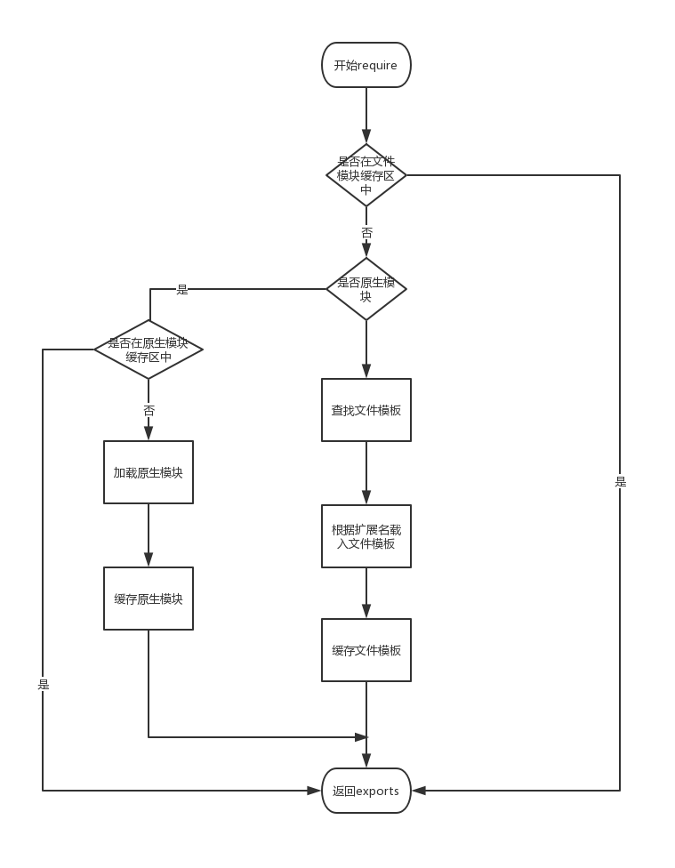

## Nodejs初识

### what it is？

- Node.js的本质是一个Javascript的解析器

- Node.js是Javascript 的运行环境

- Node.js是一个服务器程序

- Node.js本身使用的是V8引擎

- Node不是web服务器

### Why use it?

- 为了提供高性能的web服务

- IO性能强大

- 事件处理机制完善

- 天然能够处理DOM

- 社区非常活跃，生态圈日趋完善

#### 在企业中的运用

##### 1. 作为中间层

- 我们通常说前端和后端，前端负责用户界面，而后端负责提供数据和业务接口。现在我们在两者间加入一层，前端并不是直接去请求后端业务接口，而是请求到中间层。再由中间层去请求业务接口,看一下示意图：



- 整个流程可以描述为：客户端直接请求到中间层的Node服务，Node服务分析请求，看需要哪个页面，再去请求对应数据，拿到数据后和模版结合成用户看到页面，再给到客户端。

- 中间层的优点：
    1. 减轻客户端内存，项目用户体验好。不会像mvvm模式的项目把页面渲染和数据请求都压在客户端，而是在服务端完成。
    2. SEO性好，不像mvvm模式页面由js生成，而是在服务器渲染好html 字符，有利于网页被搜索到。
    3. 保持了前后端分离的优点和目的，即解放后端，后端可以继续以接口的形式写业务代码。
    4. 前端可以操控的范围增多，甚至可以做服务器，数据库层面的优化，比如中间层中常常用nginx，redis来优化项目，应对高并发。

- 中间层的缺点：
    1. 这种模式成本过高，如果没有一定量级的项目没必要去采用。

##### 2. 做项目构建工具

- 例如我们的webpack，vue-cli都是输入项目构建工具，其实它们并不难，这些工具都是用Node来写的。

##### 3. 做一些小型网站后端

- 用Node做后端，可能是大多数人认为的Node作用。其实真正在企业之中，很少会让你去用Node去做后端。 所以一般来说都是做一些小型或者个人站的后端。

### The advantage（优势）

- 处理大流量数据

- 适合实时交互的应用

- 完美支持对象数据库

- 异步处理大量并发链接


### Node的学习路线（建议）

1. 学习基础服务器，http协议知识

2. 学习Node的API

3. 尝试用Node做具体功能

4. 学习express，koa，egg等框架

5. 学习Node如何做前面说的三个实际应用

[NodeJs官网](https://nodejs.org/en/)

[NodeJs中文网](http://nodejs.cn/)

### node最简单的web服务

> 通过使用node自带的http模块，调用其http.creatServer方法在本机上开启了一个http服务，监听了本地的8000端口，代码逻辑很简单，当接收到一个req请求时，调用res.end返回一个字符串"hello world"给带客户端

- 创建 server.js

- 引入 原生 api

```js
var http = require('http');
```

- 创建一个服务

```js
http.createServer(function (request,response) {
    //定义HTTP头
    response.writeHead(200, {'Content-Type':'text/plan'});
    
    //发送相应的数据
    response.end('Hello world!\n');
}).listen(8000);

//服务运行之后输出一行信息
console.log('server is running...');
```

- 运行

```js
node server.js
```

- 打开浏览器 127.0.0.1:8000


### 提供一个API 

#### 简单JSON(不规范的请求方式)

> 先确定了一个数据模型data，内部一共有三个字段。这里的数据模型就是前端开发前与后端所定义的返回格式，最终前端要拿到这个JSON格式的数据在客户端进行处理。代码逻辑相比于Hello World，规定了返回的数据格式，以及设定了返回请求的文本类型为application/json，然后调用res.end返回到客户端。

```js
const http = require('http');

const data = {
  name: 'Nodejs 入门示例',
  description: '这是返回信息的描述内容',
  date: new Date()
};

http.createServer((req, res) => {
  res.setHeader('Content-Type', 'application/json;charset=utf-8');
  const result = JSON.stringify(data);
  res.end(result);
}).listen(8000, ()=> {
  console.log('listen on 8000!');
})
```

- 可以按照前端最常用的调用方式，如ajax或者axios来请求接口来在你的前端项目使用它。

- 但是上面例子中的接口和我们常用的接口有一个差异点，就是接口名称和返回内容均不规范，使用者直接通过没有路径的http://127.0.0.1:8000来使用接口，这跟我们日常使用的接口是完全不一样的

#### 一个规范的接口

规范的接口具备哪些条件呢？简单总结一下。
> 接口名称：接口名称要体现出大致的使用场景，例如增删改查的动作。

> 接口返回：接口返回要有规范化的标识，如成功与否错误内容等。

- 接下来通过上面这两个点，按照标准的接口规范来实现一下上面的接口，看看Nodejs是如何给前端提供接口的。这里先约定要提供的接口名称内含api标志，api所要做的动作等一些关键信息。如下格式：

>     http://localhost:8000/api/search/data?userId=12345

```js
const http = require('http');
const url = require('url');
const qs = require('querystring');

// 生成一段返回值
const genResponse = userId => ({
  success: true,
  data: {
    userId,
    name: 'Nodejs 入门示例',
    description: '这是返回信息的描述内容',
    date: new Date()
  }
});

// http服务
http.createServer((req, res) => {
  res.setHeader('Content-Type', 'application/json;charset=utf-8');
  const reqUrl = url.parse(req.url);
  // 判断接口路径是否是约定好的
  if (reqUrl.pathname === '/api/search/data') {
    // 获取链接上传来的userId参数
    const uid = qs.parse(reqUrl.query).userId;
    // 生成返回值
    const result = JSON.stringify(genResponse(uid));
    res.end(result);
  } else {
    res.writeHead(404);
    res.end('NotFund');
  }
}).listen(8000, ()=> {
  console.log('listen on 8000!');
})
```

- Nodejs另一个自带的模块url，url模块顾名思义是一个处理href的库，它将href拆分成各个子内容，同时为了能处理客户端带来的userId参数还使用了自带的querystring模块，它可以将链接上问号后的query参数获取到，以便服务端代码能使用他们，他们均属于工具库，下面看看官方对于URL模块将href拆分的颗粒度图，清晰的了解一下一个请求链接，可以被拆分成什么颗粒度。



### 阻塞与非阻塞

- 阻塞和非阻塞关注的是程序在等待调用的结果（消息，返回值）时的状态。

- 阻塞就是做不完不准回来

- 非阻塞就是你先做，我现在看看有其他事没有，做完了告诉我一声

```js
//阻塞时代码
var fs = require('fs');  

//  阻塞时用 同步读取 readFileSync  非阻塞时用  readFile
var data = fs.readFileSync('data.txt');   

console.log(data.toString());
```

```js
//非阻塞代码

var fs = require('fs');

fs.readFile('filename.txt',function(err,data){
    // todo something
    if(err){
        return console.error(err)
    }
    console.log(data.toString());
})
cosnole.log("程序执行完毕")
```

### Node.js事件驱动机制

- nodejs  是一个单进程 单线程的程序，它并不能同时并发完成更多的事情，只能通过事件或者回调来实现并发效果

- nodejs 的 api 全都是异步执行的，而且都是作为独立的线程处理的

- nodejs 中的 几乎所有的事件 都是依据观察者模式 来实现的  观察者模式 是设计模式中的一种

- EventEmitters 对象 产生  Events 实例

事件处理代码

```js
//1. 引入 events对象，创建 eventEmitter对象
var events = require('events');
var eventEmitter = new events.EventEmmitter();

//2. 绑定事件处理程序
var connctHandler = function  connected(){
    console.log('connected被调用了');
};
eventEmitter.on('connection', connctHandler()); //完成事件绑定
//3.触发事件
eventEmitter.emit('connection');

console.log("程序执行完毕");
```

### Nodejs 模块化

#### 模块化的概念和意义

- 为了让Node.js的文件可以相互调用，Node.js提供了一个简单的模块系统

- 模块是Node.js应用程序的基本组成部分

- 文件和模块是一一对应的。一个Node.js文件就是一个模块

- 这个文件可能是Javascript代码、JSON或者编译过的C/C++扩展

- Node.js中存在4类模块（原生模块和3种文件模块）

#### Node.js的模块加载流程



** 文件的缓存区 有文件模块缓存区 和 原生模块缓存区 **


- require 方法接受一下几种参数的传递： 
    1. http、fs、path等，原生模块 
    2. /mod或../mod，相对路径的文件模块 
    3. /pathtomodule/mo,绝对路径的文件模块

#### 模块化代码案例

```js
//main.js  主要调用模块的文件
var Hello = require('./hello');

hello = new Hello();
hello.setName('Richard');
hello.sayHello();
//hello.js  模块文件
function Hello(){
    var name ;
    this.setName = function(argName){
        name = argName
    }
    this.sayHello = function(){
        console.log('hello' +  name);
    }
}

module.exports = Hello;
```

### 函数

- 在javascript 中，一个函数可以作为另一个函数的参数。

- 我们可以先定义一个函数，然后传递，也可以在传递参数的地方直接定义函数。

- Nodejs 中的函数使用与Javascript 类似

```js
function say(word){
    console.log(word);
}
function execute(someFunction,value){
    someFunction(value);
}
execute(say,'hello')
```

匿名函数

```js
function execute(someFunction,value){
    someFunction(value)
}
execute(function(word){
    console.log(word)
},'hello');
```

示例Ⅱ 同样的功能，不同的实现方式

```js
//匿名函数
var http = require('http');
http.createServer(function(request,response){
    response.writeHead(200,{"Content-Type":'text/plain'});
    response.write("Hello world");
    response.end();
}).listen(8000)


//先定义后传递

var http = require("http");
function onResquest(request,reponse){
    response.writeHead(200,{"Content-Type":'text/plain'});
    response.write("Hello World");
    response.end();
}
http.createServer(onResquest).listen(8888);
```

### 路由

> 我们所需要的所有数据都会包含在request对象中，该对象作为onRequest()回调函数的第一个参数传递。但是为了解析这些数据，我们需要额外的Node.JS模块，他们分别是url 和querystring模块

- 例如我们 访问 http://localhost:8888/start?foo=bar&hello=world
```js
                url.parse(string).query
                                    |
url.parse(string).pathname          |
                        |           |
                        |           |
                     ------ -------------------
http://localhost:8888/start?foo=bar&hello=world
                            ---       -----
                            |           |
                            |           |
querystring.parse(queryString)["foo"]   |
                                        |
                    querystring.parse(queryString)["hello"]
```

```js

//server.js
var http = require("http");
var url = require("url");
 
function start(route) {
  function onRequest(request, response) {
    var pathname = url.parse(request.url).pathname;
    //console.log("Request for " + pathname + " received.");
    route(pathname,response);
   
  }
 
  http.createServer(onRequest).listen(8888);
  console.log("Server has started.");
}
exports.start = start;

//router.js
function route(pathname,response) {
  if(pathname == '/'){
    response.writeHead(200, {"Content-Type": "text/plain"});
    response.write("Hello World");
    response.end();
  }else if(pathname == "/index/home"){
    response.end('index');
  }else{
    response.end('index');
  }
}
exports.route = route;

//app.js
var server = require("./server");
var router = require("./router");
 
server.start(router.route);
```

#### 获取GET请求内容

```js
var http = require('http');
var url = require('url');
var util = require('util');  //帮助类
 
http.createServer(function(req, res){
    res.writeHead(200, {'Content-Type': 'text/plain; charset=utf-8'});
    res.end(util.inspect(url.parse(req.url, true)));
}).listen(3000);
```

#### 获取POST请求内容

```js
var http = require('http');
var querystring = require('querystring');
var util = require('util');
 
http.createServer(function(req, res){
    // 定义了一个post变量，用于暂存请求体的信息
    var post = '';     
 
    // 通过req的data事件监听函数，每当接受到请求体的数据，就累加到post变量中
    req.on('data', function(chunk){    
        post += chunk;
    });
 
    // 在end事件触发后，通过querystring.parse将post解析为真正的POST请求格式，然后向客户端返回。
    req.on('end', function(){    
        post = querystring.parse(post);
        res.end(util.inspect(post));
    });
}).listen(3000);
```

### 全局对象与全局变量

** global 就是nodejs的全局对象 类比javascript的window **

- __filename：__filename 表示当前正在执行的脚本的文件名。它将输出文件所在位置的绝对路径，且和命令行参数所指定的文件名不一定相同。 如果在模块中，返回的值是模块文件的路径。

- __dirname：__dirname 表示当前执行脚本所在的目录。

- setTimeout(cb, ms)：setTimeout(cb, ms) 全局函数在指定的毫秒(ms)数后执行指定函数(cb)。：setTimeout() 只执行一次指定函数。返回一个代表定时器的句柄值。

- clearTimeout(t)：clearTimeout( t ) 全局函数用于停止一个之前通过 setTimeout() 创建的定时器。 参数 t 是通过 setTimeout() 函数创建的定时器。

- setInterval(cb, ms)：setInterval(cb, ms) 全局函数在指定的毫秒(ms)数后执行指定函数(cb)。返回一个代表定时器的句柄值。可以使用 clearInterval(t) 函数来清除定时器。setInterval() 方法会不停地调用函数，直到 clearInterval() 被调用或窗口被关闭。

- process：process 是一个全局变量，即 global 对象的属性。它用于描述当前Node.js 进程状态的对象，提供了一个与操作系统的简单接口。通常在你写本地命令行程序的时候，少不了要 和它打交道。下面将会介绍 process 对象的一些最常用的成员方法。

### 文件系统

#### 读取文件

```js
var fs = require("fs");

// 异步读取: 异步的意思就是读文件这个操作进行的同时，读操作下面的JavaScript代码也在执行，就如同我们熟悉的软件后台运行一样，你可以继续你的桌面操作。
fs.readFile('input.txt', function (err, data) {
   if (err) {
       return console.error(err);
   }
   console.log("异步读取: " + data.toString());
});
// 同步读取: 同步可以理解为读文件这个过程要等待，就是一旦执行的读这个操作的时候，你的代码就被”卡“住了，直到文件读完才能继续执行
var data = fs.readFileSync('input.txt');
console.log("同步读取: " + data.toString());

console.log("程序执行完毕。");
```

#### 打开文件

> fs.open(path, flags[, mode], callback) 参数说明：

- path - 文件的路径。

- flags - 文件打开的行为。

- mode - 设置文件模式(权限)，文件创建默认权限为 0666(可读，可写)。

- callback - 回调函数，带有两个参数如：callback(err, fd)。

#### 获取文件信息

> fs.stat(path, callback) 参数说明

- path - 文件路径。

- callback - 回调函数，带有两个参数如：(err, stats), stats 是 fs.Stats 对象。

#### 写入文件

> 同步：fs.writeFile(file, data[, options], callback)
> 异步：fs.writeFileSync(file, data[, options], callback)

- file - 文件名或文件描述符。

- data - 要写入文件的数据，可以是 String(字符串) 或 Buffer(缓冲) 对象。

- options - 该参数是一个对象，包含 {encoding, mode, flag}。默认编码为 utf8, 模式为 0666 ， flag 为 'w'

- callback - 回调函数，回调函数只包含错误信息参数(err)，在写入失败时返回。

```js
var fs = require("fs");

console.log("准备写入文件");
fs.writeFile('input.txt', '我是通 过fs.writeFile 写入文件的内容',  function(err) {
   if (err) {
       return console.error(err);
   }
   console.log("数据写入成功！");
   console.log("--------我是分割线-------------")
   console.log("读取写入的数据！");
   fs.readFile('input.txt', function (err, data) {
      if (err) {
         return console.error(err);
      }
      console.log("异步读取文件数据: " + data.toString());
   });
});
```