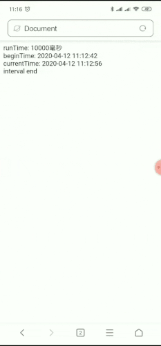
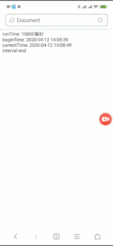
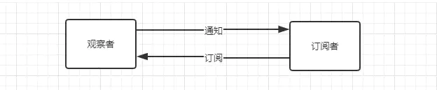
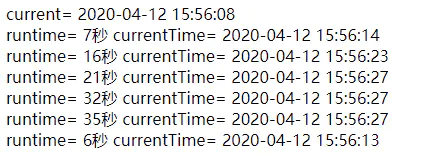

# 定时器的坑

我们常用 setInterval 来实现前端倒计时，最近工作中遇到了两个小坑

1. 在移动端，浏览器切到后台，页面的定时器就被暂停了，重新打开浏览器时，倒计时才继续执行，这就导致倒计时执行时长变长了。

2. 一个页面有多个倒计时，比如商品列表的开售倒计时，当页面打开停留较长时间后，会发现有的商品倒计时会不准确。

## 第一种场景：浏览器切到后台，倒计时执行时长变长了。

- 定时器被暂停是因为浏览器将页面的线程停止了，毕竟浏览器已经被切到后台，为了性能考虑，所以将页面线程停止也是合理的，这就导致我们的定时器一并被暂停。但有时需求不允许这种操作

eg:
```js
let text = document.querySelector('#text');
let beginTime = document.querySelector('#beginTime');
let end = document.querySelector('#end');
let runTime = 10 * 1000;
beginTime.innerHTML = moment().format('YYYY-MM-DD HH:mm:ss');
let interval = setInterval(() => {
    if (runTime > 0) {
        runTime -= 1000
        text.innerHTML = 'currentTime:' + moment().format('YYYY-MM-DD HH:mm:ss')
    } else {
        end.innerHTML = 'end';
        clearInterval(interval)
    }
}, 1000)
```
runTime表示倒计时的执行总时长， currentTime 显示每次执行时的当前时间，那么期望时最后一次的执行时间应该等于倒计时开始的时间加上执行的时长 currentTime = beginTime + runTime 如下图

```js
runTime: 10000毫秒
beginTime: 2020-04-20 11:09:10
endTime: 2020-04-20 11:09:20
interval end
```


- 移动端如果在执行过程中将浏览器切换到后台，最后一次的执行时间明显超过了预定运行时长，原因上文说了，所以运行的时长需要改成如下 ** 剩余运行时长 = 运行时长 - 间隔时间 - 线程暂停时间** 线程暂停时间就是与上一次的执行时间间隔。

- 把定时器部分成修改如下，watchTimeInterval 是封装后的自带校准的定时器函数

```js

watchTimeInterval(runTime,1000,()=>{
    text.innerHTML = 'currentTime: ' + moment().format('YYYY-MM-DD HH:mm:ss') //new Date().getTime();
},()=>{
    end.innerHTML = ' interval end';
})

/**
 * @description
 * 倒计时-计时器-浏览器进程切后台后，去除进程暂停时间
 * @param {number} time 倒计时时长，单位毫秒
 * @param {number} point 倒计时间隔
 * @param {function} func 倒计时执行函数
 * @param {function} timeOverFunc 倒计时结束执行函数
 * @returns {TimeOut} 倒计时唯一标识
 * @example
 * Utils.watchTimeInterval(10*1000, 1000, () => {}, () => {})
 */
function watchTimeInterval(time, point, func, timeOverFunc) {
    let _time = time;
    let startTime = new Date().valueOf();
    let interval = setInterval(() => {
        let gap = (new Date().valueOf() - startTime - point);
        if (gap < 0) {
            gap = 0;
        }
        _time = _time - gap;
        startTime = new Date().valueOf();
        if (_time > 0) {
            func && func();
            _time -= point;
        } else {
            interval && clearInterval(interval)
            timeOverFunc && timeOverFunc();
        }
    }, point)
    return interval
}
```


## 第二种场景: 多个倒计时不准确。

- js中的异步事件是通过一个循环队列来实现的，定时器的回调函数会进入到宏队列中，等待被执行，所以定时器的执行时间并不是百分百准确的，如果主线程被阻塞（我们这里暂时先不考虑这种情况）或者循环队列有多个任务，或其中有耗时的操作，那么定时器就会慢慢变得有误差。

- 页面中同时存在多个定时器，就意味着循环队列中会同时存在多个回调函数在等待执行，若回调函数中有一些同步的数据请求或耗时的时间计算等，在页面打开的前一小段时间也许看不出来，但当页面打开较长时间，累积的误差越来越大。

- 导致这一问题的根本原因就在于同时存在的定时器太多了，生成的回调事件都在排队等着执行。减少定时器的数量就是我们需要解决的问题。

** 解决方法 **

- 采用观察者模式来实现。

- 观察者模式是一对多的设计，多个订阅者在观察者中添加订阅，观察者发现变化，通知相应的订阅者，如下简图：



### 观察者

- 观察者只有一个，我们将定时器放在观察者中就非常适合，观察者通过观察定时器的变化，进而根据预设的条件通知订阅者。

```js
/**
 * @description
 * 为解决页面中同时存在多个倒计时的情况下，生成多个计时器导致计时出现偏差的问题。
 * 采用观察者模式，由一个定时器控制多个倒计时事件
 * @class SuspendTimeNotify
 */
class SuspendTimeNotify {
    /**
     * Creates an instance of SuspendTimeNotify.
     * @param {*} [ intervalPoint=200 ] intervalPoint:计时器执行的间隔时间
     * @memberof SuspendTimeNotify
     */
    constructor(params) {
        const {intervalPoint=200} = params || {}
        this._currentTime = Date.now(); // 定时器回调函数执行的当前时间点
        this._passTime = 0; // 已经执行的时长
        this.observers = []; // 订阅者列表
        this._interval = null; // 定时器id
        this._intervalPoint = intervalPoint // 定时器间隔
    }
    /**
     * @description
     * 添加订阅者
     * @param {object} observer
     * @memberof SuspendTimeNotify
     */
    attach(observer) {
        let item = {
            key: `${this.observers.length}_key`,
            target: observer
        }
        this.observers.push(item);
    }
    /**
     * @description
     * 停止观察者的倒计时对象和情况订阅者
     * @memberof SuspendTimeNotify
     */
    stop() {
        this.observers = [];
        this._interval && clearInterval(this._interval)
    }
    /**
     * @description
     * 通知订阅者，订阅者通过 update 返回是否还继续订阅，若为 false ，则从订阅者队列中删除
     * @memberof SuspendTimeNotify
     */
    notifyObserver() {
        let deleteKeys = '';
        for (const { key, target } of this.observers) {
            let result = target.update(this._passTime);
            if (result) {
                deleteKeys += `${key},`
            }
        }
        if (deleteKeys) {
            this.observers = this.observers.filter(({ key }) => deleteKeys.indexOf(key) < 0)
        }
    }
    /**
     * @description
     * 启动倒计时
     * @memberof SuspendTimeNotify
     */
    start() {
        if (this._interval) {
            clearInterval(this._interval)
        }
        this._interval = setInterval(() => {
            let _nowTime = Date.now();
            this._passTime += _nowTime - this._currentTime;
            this._currentTime = _nowTime;
            this.notifyObserver();
        }, this._intervalPoint);
    }
}
```

- 在 notifyObserver 方法中调用了订阅者 target.update() 方法，通过这个方法通知订阅者，为了避免已经不需要执行定时器的订阅者还存在队列中，所以订阅者需要返回 boolean 值，表示是否继续订阅。

### 订阅者

- 设计好了观察者，订阅者就较简单了，只要实现 update 方法即可，但为了订阅者的结构能够统一，且尽量与业务对象低耦合，所以单独实现 SuspendTimeObserve 的订阅者对象。

- 这里要求业务对象需要实现 run 方法，用于执行定时器的回调。

```js
/**
 * @description
 * 定时器订阅者
 * @class SuspendTimeObserve
 */
class SuspendTimeObserve {
    /**
     *Creates an instance of SuspendTimeObserve.
     * @param {object} item 业务对象，业务对象可通过 run 方法获取定时器执行回调
     * @param {number} countdownTime 需要倒计时的总时长，单位毫秒
     * @memberof SuspendTimeObserve
     */
    constructor(item, countdownTime) {
        this.item = item
        this.countdownTime = countdownTime
    }
    /**
     * @desc
     * 接收观察者的通知事件
     * @param {number} passTime 已经执行的时长，单位毫秒
     * @returns {boolean} 是否继续订阅
     * @memberof SuspendTimeObserve
     */
    update(passTime) {
        var leftCountdownTime = this.countdownTime - passTime;
        this.item.run && this.item.run({ leftCountdownTime, passTime });
        return leftCountdownTime <= 0;
    }
}
```

### Demo



```js
// 业务对象
class Plan {
    constructor(i, time) {
        this.item = window.document.querySelector('#_' + i)
        this.time = time;
        this.item.querySelector('#runtime').innerHTML = 'runtime= '+time/1000 + '秒  '
    }
    run({ leftCountdownTime }) {
        if (leftCountdownTime > 0) {
            this.item.querySelector('#currentTime').innerHTML = 'currentTime= '+ moment().format('YYYY-MM-DD HH:mm:ss');
        }
    }
    getTime() { return this.time }
}
// 创建观察者
const suspendTimeNotify = new SuspendTimeNotify({ intervalPoint: 1000 });
for (let i = 1; i < 7; i++) {
    let runTime = i * Math.floor(Math.random() * 10)
    const plan = new Plan(i, runTime * 1000)
    // 由业务对象创建订阅者
    const ob = new SuspendTimeObserve(plan, plan.getTime())
    // 添加订阅者
    suspendTimeNotify.attach(ob)
}
// 启动定时器
suspendTimeNotify.start()
document.querySelector('#current').innerHTML = 'current= '+moment().format('YYYY-MM-DD HH:mm:ss');
```
